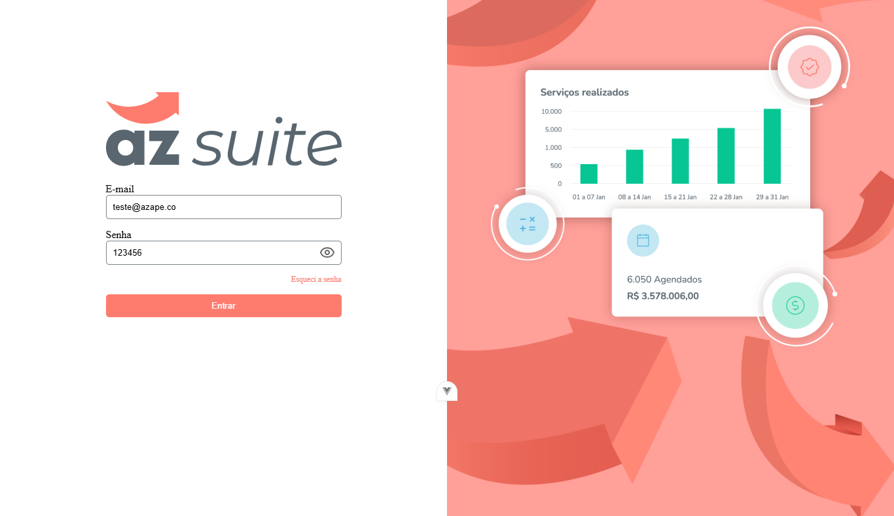

# Az Proof Frontend


Este é o frontend do desafio técnico da Azape, desenvolvido com Vue.js.

## Tecnologias Utilizadas
- Vue.js 3
- Vue Router
- Axios
- Pinia (ou Vuex) para gerenciamento de estado
- CSS 

## Instalação
## Clone o repositório e instale as dependências:

```sh
git clone https://github.com/seu-usuario/az_proof_frontend.git
```
## Entre na pasta
```
cd az_proof_frontend
````
## Instale as dependências
```
npm install
```
